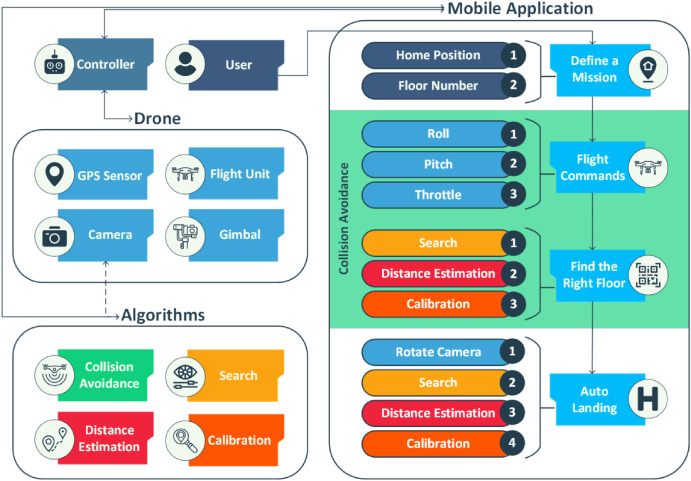
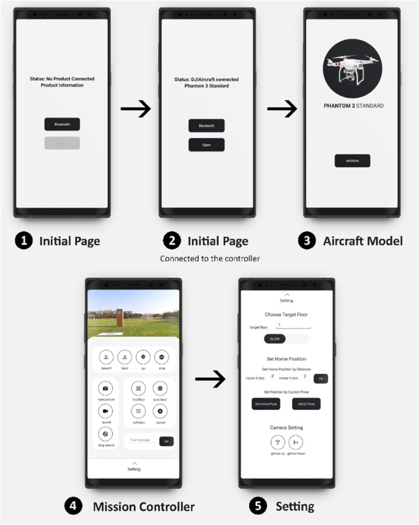

# Autopilot Drone in Construction

This is a mobile application for paper [Autopilot drone in construction: A proof of concept for handling lightweight instruments and materials](https://www.sciencedirect.com/science/article/pii/S2590123024007539?via%3Dihub). <br />

This paper presents a proof of concept for automating the lifting procedure of lightweight instruments and materials in construction sites.  <br />
The below chart shows the system overview that consist of a drone, a moblie application and machine vision algorithms.



This is the application overview. This application is
designed for defining a mission and automatically controlling the UAV through the transportation operation.



This application is built based on [DJI Mobile SDK for Android](https://github.com/dji-sdk/Mobile-SDK-Android). <br />


## Getting Started

### Installation

We integrate the [Monodepth2](https://openaccess.thecvf.com/content_ICCV_2019/html/Godard_Digging_Into_Self-Supervised_Monocular_Depth_Estimation_ICCV_2019_paper.html) algorithm into the system in order to avoid unpredicted collisions during flight. <br />
* Download the Monodepth2 from [here](https://github.com/nianticlabs/monodepth2).
* Extract the `monodepth2-master` into `app/src/main/java/pythonPackage/monodepth2` directory.
* Download the `mono_640x192` precomputed disparity predictions from the given link in their repository.
* Extract the file into the `monodepth2/models`


### Build and Run:

#### Building project

* Build from Android Studio:

    * Click the "Build" menu and select "Make Project" 

* Build from Command Line:

    * Open a terminal window and navigate to the project's root directory.
    Run `./gradlew build` (or `gradlew build` on Windows) to execute the build process from the command line.


#### Running project

* Run from Android Studio:

    * Click the green "Run" button (play icon) in the toolbar.
    Select a connected device or emulator from the dropdown.
    Android Studio deploys the APK to the chosen device and launches the app.

* Run from Command Line:

    * After a successful build, run the app directly on a connected device using: 
        ```sh
        adb shell am start -n com.dji.sdk.autopilot/MainActivity